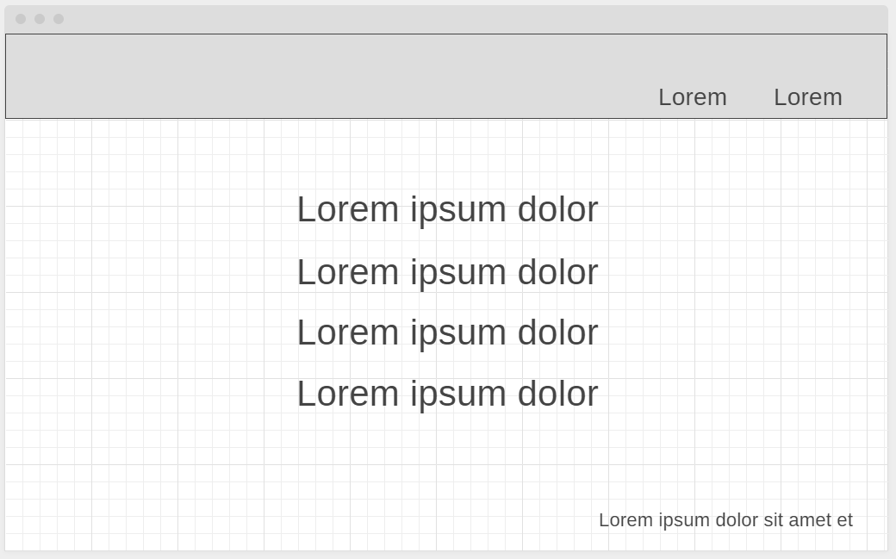
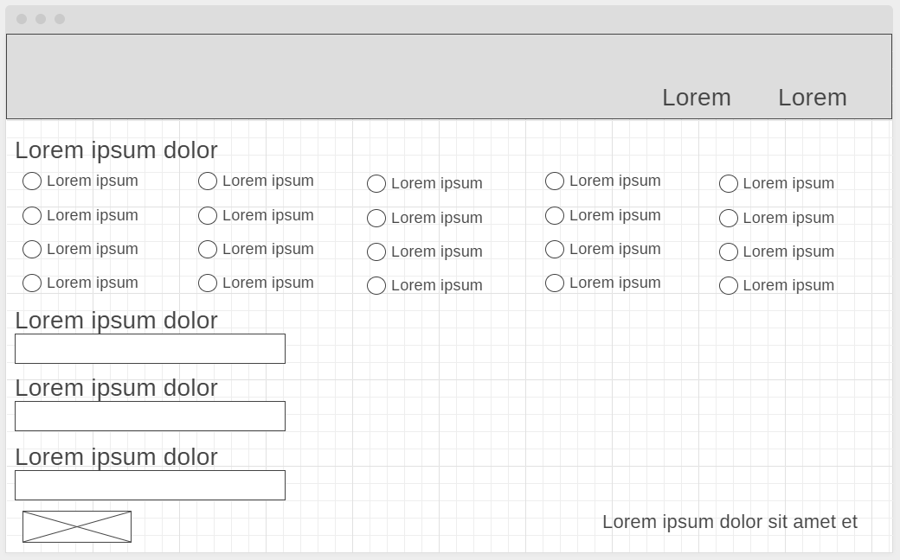
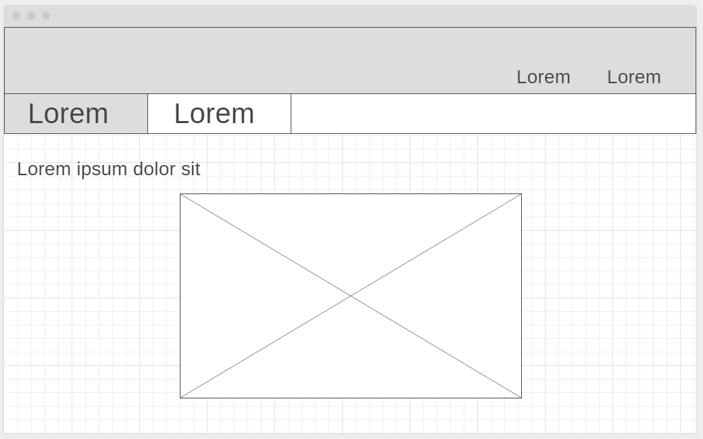
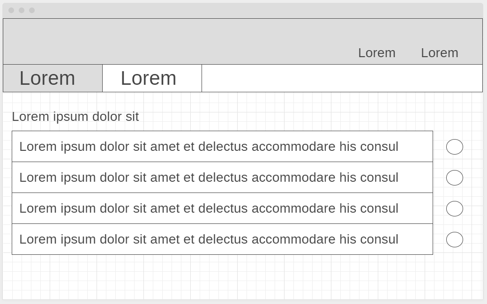
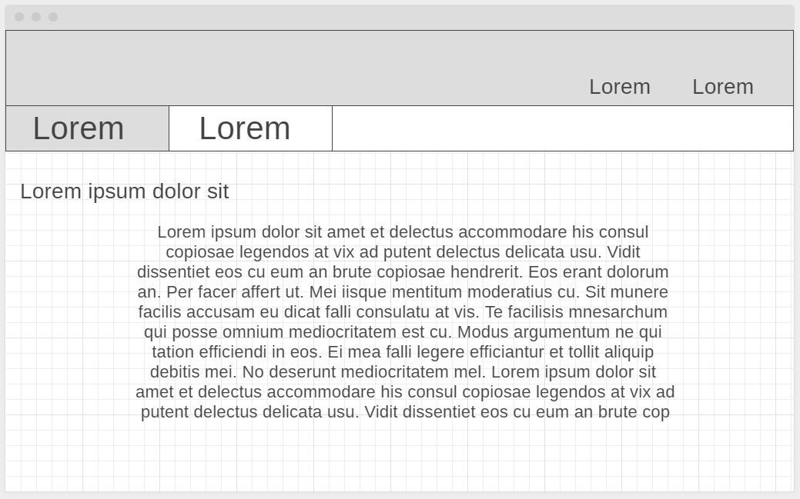
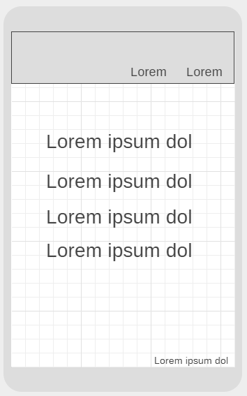
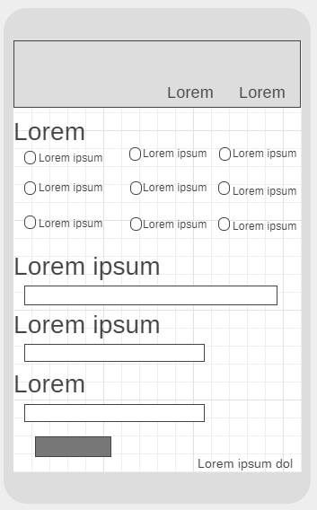
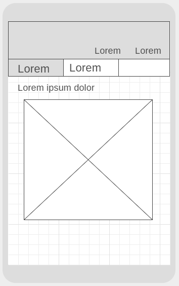
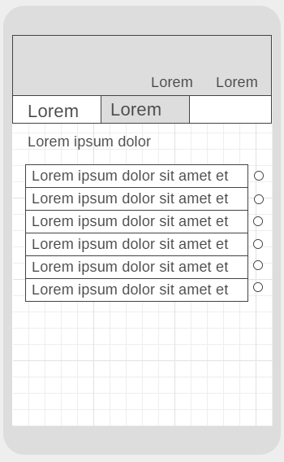
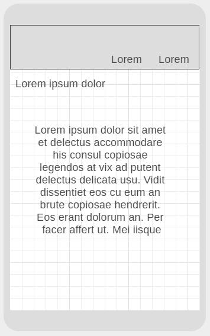

# **Web Technologies**
# Solent University Unit Code: CDA404
# *By Paris Hall*
## Background 
### The current system in place for renting IT equipment is very manual and is all reliant on the IT department inputting data and checking dates, most of these requests come via email but they can be verbal communication in person or over the phone so it leaves all responsibility onto the IT department and there is room for human error. With a new system we could have users request their own equipment and have traceable confirmations and a reliable audit trail. The system is very manually and heavily relies on the IT department to do a lot of the work and take all the responsibility. Currently the system operates off SharePoint and is manually entered into the calendar, communication can be via email, telephone or face to face conversation between the customer and IT department.
### My website will allow for users to request IT equipment in there own time and send push notifications to the IT department and send confirmations when the IT department have accepted the request. 
## Wireframes: 
### As part of the assignment I created some low fidelity wireframes that I used as a plan to created my website. These dont match exactly to the final product as I found some challenges and issues with accessibility. I intended for my website to have 4 pages with one containing a tab, but in my final product I added another page where the customer could view previous requests which also contained a tab.
## Desktop Wireframes
### This is my intended landing/home page.

### This is the request page.

### This is the inventory page for the IT department to view a calendar of requests.

### This is the second tab in the inventory page which is a table of requests.

### This is the contact page for customers to reach the IT department with any issues.

## Mobile Wireframes
### Below are the mobile wireframes for my website.

### I also went one step further and created a prototype of my website wireframes in Figma.
### [Figma Wireframes](https://www.figma.com/file/L5oKf7u1PZHTiidpx5uWpW/Web-Tech)
## Colour Choices: 
### I conversed with my IT department on what colour scheme would fit with the company and found NETSCC have a blue theme. I tried to keep the website simple but modern and used a very small range of colours including blue, white and black and a relevant picture to modernise the look.
## Accessibility:
### My original design for the landing page was writing on a picture but I realised this isn't great for users who need visual aid so I had to change this in my final design.
## GDPR & Distance Selling: 
### My company have a whole range of GDPR and Distance Selling rules and regulations they need to abide by which I read into. However I some of it wasn't relevant for my website as it will onl be accessible by internal users so I researched more online and came up with my own guidance for the customer and attached this onto the landing page. 
### Right to be informed Right of access Right to rectification Right to erasure Right to restrict processing Right to data portability Right to object.
## Evalution
### My previous knowledge in web technologies was non existant, and I have learnt a lot throughout this course including:
* How to create a range of different types of websites and obejects in HTML 
* How to design and format a page with CSS
* Basic Javascript for validating forms and if else quearies to display and hide tabs
* How to use markdown to write my report
### I think my original idea was quite complex which meant I had a lot of work and research to do. If I could go back I think I would change my original idea, but I do feel I overcame the challenges and created a great website. I believe my time management was great as I started creating my website when the assignment was set and have set little milestones when I need to have certain aspects finalised by. My first step was to create the wireframes, I used both low and high, and from there I would create the landing page and relevant files and references. I tried to keep my aliases clean so when it came to referencing in my CSS it would be easy and I could use it for all sheets saving me time on my code. I found some tips when creating large CSS files in which you alphabetically organise your stylesheet under each reference to save time when looking for a specific item when the page scales to a larger size. I researched that it is also a good idea to keep your stylesheets seperate and an inexperienced user I liked this technique but i felt I repeated a lot of the same code.
### I have not yet created the backend for the website as it wasn't in the spec, therefore the request dont yet go to other pages but I have set up all the tables for this to be easily implimented. I also researched into using a Google API to use my companies work login but found this rather difficult without using a database and thought it wasn't nessessarily for my website to run but could add it in later on.
### My design changed from what I had planned originally due to assessibility it was difficult to comfortably view the landing page so I added a white box behind the text.